<h1 align="center">ullage</h1>

<p align="center"><strong>The GPU your cluster paid for and didn't use.</strong></p>

<p align="center">
  <a href="https://github.com/ganeshkumarashok/ullage/actions/workflows/ci.yaml"></a>
  <a href="LICENSE"></a>
  
  
  
</p>

<p align="center">
  
</p>

<p align="center"><em>Allocated is not the same as used. Unused is not the same as wasted.<br>The gap between them is the thing this measures.</em></p>

`ullage` measures the accelerator capacity a Kubernetes cluster is paying for
and not using, attributes it to the workload and the person responsible, and
gives you the next command to run — the one that frees the capacity where that
is safe, and the one that identifies what is blocking it where it is not.

It is a measurement, not a verdict. It never writes to your cluster.

**[Thirty seconds](#thirty-seconds)** ·
[Why another tool](#why-another-tool) ·
[How it compares](#how-it-compares) ·
[What it will not do](#what-it-will-not-do) ·
[Install](#install) ·
[Use it for real](#use-it-for-real) ·
[Checks](#checks) ·
[Adding a check](#adding-a-check) ·
[Suppressing](#suppressing)

## Thirty seconds

No Kubernetes, no Prometheus, no cloud account, no configuration:

```console
$ git clone https://github.com/ganeshkumarashok/ullage && cd ullage
$ make demo
```

```
ullage v0.1.0  demo  window 14d

  5.9k of 22k accelerator-hours fallow (27%)
  60 of 68 accelerators analysed  (8 excluded, see below)

      WORKLOAD                      GPUS   ULLAGE    FOR OWNER           
  1.  research/jupyter-alice           3     1.0k    14d alice@…         
      3 pods, no GPU work since the window began · owned by StatefulSet
      ~$3,427  ·  3 × NVIDIA-A100-SXM4-80GB

  2.  pool/l4-serving                  8     2.7k    14d platform        
      2 nodes, nothing scheduled · 2 pods block scale-down
      ~$2,016  ·  8 × NVIDIA-L4

  3.  research/dra-sandbox-erin        4     1.1k    11d erin@…          
      no GPU work since 31 Jul 06:00
      ~$1,690  ·  4 × NVIDIA-L40S

  4.  research/scratch-pod-bob         2      432     9d bob@…           
      no GPU work since 2 Aug 06:00
      ~$1,469  ·  2 × NVIDIA-A100-SXM4-80GB

  5.  ml-platform/finetune-carol       1      336    14d ml-platform@…   
      no GPU work since the window began · owned by Notebook (no safe automatic fix)
      ~$1,142  ·  1 × NVIDIA-A100-SXM4-80GB

  6.  research/gappy-session-frank     1      240    10d …arch-platform@…
      no GPU work since 1 Aug 06:00
      ~$816  ·  1 × NVIDIA-A100-SXM4-80GB
      confidence: medium — sample coverage is incomplete over the window

  7.  serving/embed-v2                 1       96     4d serving-team@…  
      CrashLoopBackOff
      ~$326  ·  1 × NVIDIA-A100-SXM4-80GB

  Fallow by design
  16 accelerators, 5.4k — held empty on purpose, not counted as waste
    · pool/h100-reserve: 16 accelerators on pool/h100-reserve are held empty deliberately
      pool/h100-reserve is held at a minimum of 2 nodes by the cluster
      autoscaler, so these nodes are kept on purpose. ullage cannot tell whether
      that reservation is still needed — this is shown so the decision stays
      visible, not because it is wrong.

  Not analysed
    · 2 accelerators — shared-device
      pool t4-shared is time-slicing, 4 replicas per device. Device-level
      utilization reflects every co-tenant, so an idle pod sharing a device with
      a busy one is invisible
    · 2 accelerators — mig-instance
      pool a100-mig has MIG enabled (mixed strategy). Device-level utilization
      is not meaningful per MIG instance
    · 4 accelerators — driver-initialising
      pool a10-new has GPU hardware that is not yet allocatable — the driver
      or device plugin is still starting

  Unmet demand
    4 pods are waiting for 4 accelerators — 4 reported Unschedulable by the scheduler
    This is context, not a finding: pending pods hold no devices.

  Costs use built-in list prices (approximate; override with --pricing).

  Next: ullage explain research/jupyter-alice
        shows the evidence, the owner, and the exact command to fix it
```

Every number above is computed, not canned. The demo runs the production
pipeline — the same client, queries, checks and renderer — against in-memory
HTTP servers that serve Kubernetes- and Prometheus-shaped responses. They are
stand-ins for the real thing, not a real API server and a real Prometheus, but
nothing between them and the output is staged. `ullage demo --serve` exposes
those endpoints so you can point the real CLI at them and confirm that.

### Then ask why

A number nobody can act on is a number nobody reads. `ullage explain` opens one
finding: the evidence behind the claim, what the claim deliberately stops short
of saying, who owns the workload, the next command to run, and what that
command will cost whoever is using it. Where something blocks the obvious fix,
the command it gives you is the one that finds the blocker — and it says so,
rather than handing you a scale-down that will silently do nothing.

```console
$ ./bin/ullage explain research/jupyter-alice --demo
```

<details>
<summary>the whole thing, verbatim — 3 accelerators, an owner, one command, and the reason the obvious command is wrong</summary>

```
  research/jupyter-alice
  idle-pod · research/jupyter-alice: 3 accelerators held with no work for 14d

  Evidence
    Window           14d ending 11 Aug 2026 07:00 UTC
    Fallow for       14d
    Last GPU work    none within the window
    Peak utilization 0% across the whole window
    Power draw       56 W mean (14% of 400 W TDP)
    Sample coverage  100% of expected samples present

    Utilization      ▁▁▁▁▁▁▁▁▁▁▁▁▁▁  all zero
                 14d ago    now

  What this means
    Every utilization sample for these accelerators read exactly zero for the
    last 14d. ullage does not claim the workload is unimportant, and it does not
    estimate how efficiently it ran — GPU utilization is a poor measure of
    that. It claims only what the metric can prove: no CUDA kernel was resident
    on these devices at any sampled moment in that time. Power draw
    independently agrees: the devices are drawing near-idle wattage.

  Accelerators
    Held             3 × NVIDIA-A100-SXM4-80GB (exclusive)
    Fallow           1.0k accelerator-hours
    Cost             ~$3,427 over the window
                 built-in list prices (approximate; override with --pricing) rate for NVIDIA-A100-SXM4-80GB; ullage never blends rates across models

  Managed by
    Root owner       StatefulSet/jupyter-alice

  Owner
    Owner            alice@example.com
    Resolved via     pod-annotation
               ullage.dev/owner=alice@example.com

  What to do
    Deleting the pods will not free the devices — StatefulSet jupyter-alice
    recreates them.

    kubectl scale statefulset -n research jupyter-alice --replicas=0

    Confirm with alice@example.com before running this.

  Before you do
    These pods are Running, not Completed. State held only in the container
    filesystem will be lost. ullage measures idleness, not intent, and cannot
    distinguish an abandoned session from capacity held warm on purpose.

  Stop it happening again
    Interactive GPU sessions are the most common source of this finding. A TTL
    controller, an activity-based idle culler, or a scheduled scale-to-zero for
    notebook workloads removes the class of problem rather than this instance of
    it.

  Suppress: ullage ignore idle-pod/research/jupyter-alice --reason "..." --until 2026-11-11
  Docs:     https://github.com/ganeshkumarashok/ullage/blob/main/docs/checks/idle-pod.md
```

</details>

Note what it targets. Three idle pods owned by a StatefulSet do not go away
with `kubectl delete pod`; the controller recreates them and nothing is freed.
`ullage` walks the ownership chain to the root and suggests scaling the
StatefulSet instead. Where the root is a CRD it does not recognise, it names
the resource and prints **no command at all**.

Three more things worth running before you decide whether to trust it. All use
the same demo cluster, and none of them touch anything real:

| run this | and you see |
|---|---|
| `make tour` | the two-minute version of the whole idea, including what the tool deliberately refuses to claim — which is the interesting part |
| [`examples/ci-gate.sh`](examples/ci-gate.sh) | a build failing when waste goes over a budget, and why a scan that broke must not exit like a scan that found nothing |
| [`examples/weekly-digest.sh`](examples/weekly-digest.sh) | one scan turned into a Markdown report grouped by owner, with `jq` |

## Why another tool

Every GPU dashboard can already show you a utilization graph. A graph answers
*what is happening*; the question you usually have is *what should I do about
it*, and the distance between the two is a person with a spreadsheet.

`ullage` is built around four things a dashboard is not trying to do.

**It finds what is blocking your autoscaler.** An empty node is visible
anywhere. *"These two pods with `safe-to-evict: false` are why the autoscaler
cannot reclaim it"* is causal, is not visible anywhere else, and is the finding
most likely to be worth real money.

**It targets the controller, not the pod.** Three idle notebook pods owned by a
StatefulSet do not need `kubectl delete pod` — the controller recreates them
within seconds and nothing is freed. `ullage` walks the ownership chain to the
root and suggests `kubectl scale statefulset --replicas=0` instead. When the
root is a CRD it does not recognise, it names the resource and emits **no
command at all**, because refusing to guess is worth more than a plausible
command that does the wrong thing.

**It separates deliberate from wasteful.** Capacity held empty by an autoscaler
minimum is reserved, not wasted. It appears under *fallow by design*, with no
removal command attached. Printing reserved capacity in the same list as waste
is the fastest way for a tool to be dismissed as not understanding the business.

**It says what it did not look at.** Time-sliced and MIG devices are excluded,
by name and with a reason, because a device-level metric there reflects every
co-tenant. The accelerator census always reconciles: analysed plus excluded
equals observed. A percentage over a denominator you cannot account for turns a
monitoring gap into a claim about efficiency.

### How it compares

| | what it answers | acts on the cluster |
|---|---|---|
| **ullage** | which accelerators were paid for and idle, whose they are, and the one command that frees them | no — read-only by construction |
| [Robusta KRR](https://github.com/robusta-dev/krr) | what CPU/memory requests should be, from usage history | not by default — an optional enforcer can apply them |
| [OpenCost](https://www.opencost.io/) | what each workload cost, including GPU | no — allocation and showback |
| [Kubecost](https://www.kubecost.com/) | cost allocation, with efficiency and savings reports | optionally — self-hosted Actions can resize and turn down |
| [Cast AI](https://cast.ai/) | how to run the same workloads for less | yes — bin-packs and replaces nodes |
| [nvidia-dcgm-exporter](https://github.com/NVIDIA/dcgm-exporter) | per-device utilization metrics | no — it is the data source ullage reads |

KRR is the closest in spirit and the clearest influence: right-sizing from
observed usage, delivered as a recommendation rather than an action. It does not
cover accelerators, which are the expensive part of a GPU cluster and the part
whose idleness is hardest to read from a utilization metric.

OpenCost and Kubecost answer *what did this cost*. `ullage` answers *what did
this cost for nothing, and what do I type to stop it*. They compose: run
OpenCost for allocation, `ullage` for the subset that bought nothing.

## What it will not do

- **It will not call a workload inefficient.** GPU utilization is a poor measure
  of how hard a device is working — a single-threaded kernel reads 100%. The
  only thing the metric supports is its zero, so *zero* is the only thing
  `ullage` claims.
- **It will not trust one gauge to mean "idle".** `DCGM_FI_DEV_GPU_UTIL`
  reports SM activity alone. A transcoding pipeline living on NVENC, a job
  moving data over the copy engines, and a model sitting resident in
  framebuffer waiting for requests all read a clean zero on it. `ullage` also
  reads the encoder, decoder, copy-engine and framebuffer gauges, and a device
  busy on any of them is not reported. Where those gauges are not exported it
  says so in the output rather than treating the SM zero as the whole story.
- **It will not treat a low average as idle.** A job running one hard hour in
  twenty-four averages 4%. Tools that threshold on averages flag it; its owner
  loses real work.
- **It will not read absent samples as zero.** An exporter that died a week ago
  is not a fleet that went idle.
- **It will not write to your cluster.** The Kubernetes client has no write
  methods. That is a property of the code, not a promise.
- **It will not phone home.** There is no telemetry and no analytics, and
  `ullage` itself opens no connection except to your API server and your
  Prometheus. The one exception is not its own: if your kubeconfig uses an exec
  credential plugin, `ullage` runs it exactly as `kubectl` would, and `az`,
  `aws` or `gke-gcloud-auth-plugin` will talk to your identity provider.

## Install

One binary, one third-party Go dependency ([`yaml.v3`](https://gopkg.in/yaml.v3)).
No client-go, no controller-runtime, no vendored Kubernetes tree, no CRDs, no
agent, no operator, and nothing to install into your cluster. A clone builds in
a few seconds and the test suite runs without a cluster.

From source — works today, needs Go 1.24+:

```console
git clone https://github.com/ganeshkumarashok/ullage && cd ullage
make install          # go install into $GOBIN (use `make build` for ./bin/ullage)
```

Or build the container — 16MB, distroless, and non-root (`USER 65532`). The
supplied CronJob additionally runs it with a read-only root filesystem and every
capability dropped:

```console
make image     # tags ghcr.io/ganeshkumarashok/ullage:$(git describe --tags)
docker run --rm ghcr.io/ganeshkumarashok/ullage:v0.1.0 demo
```

Once `v0.1.0` is tagged, these will also work, and this note will go away:

```console
go install github.com/ganeshkumarashok/ullage/cmd/ullage@latest
docker run --rm ghcr.io/ganeshkumarashok/ullage:v0.1.0 demo
kubectl krew install ullage && kubectl ullage demo
```

## Run it on a schedule

```console
kubectl apply -f deploy/rbac.yaml
kubectl apply -f deploy/cronjob.yaml
```

[`deploy/rbac.yaml`](deploy/rbac.yaml) is the permission set, one `apiGroups`
block at a time with a comment explaining why each is needed. Every verb is
`get` or `list` — nothing in it can change anything. ConfigMap access is scoped
by `resourceNames` to the single autoscaler status object rather than granted
cluster-wide.

It cannot cover custom controllers, and on a GPU cluster it often will not: if
your pods are owned by a `PyTorchJob`, a `RayCluster` or an Argo `Workflow`,
ullage cannot read them under this file. Rather than silently attributing those
pods to nobody, it warns and names the kind, so the missing grant is a two-line
edit instead of a mystery.

The CronJob runs weekly, not hourly, and that is deliberate: `ullage` measures a
two-week window and reports capacity that has been fallow for days. Running it
sixty times to produce the same seven findings is how a tool becomes background
noise.

## Use it for real

```console
ullage doctor --prometheus https://prometheus.example.com
ullage --prometheus https://prometheus.example.com
ullage explain research/jupyter-alice
```

`doctor` first. It tells you which prerequisite is missing, so an empty first
run is never ambiguous between *"your cluster is efficient"* and *"my setup is
broken"* — two outcomes that look identical and mean opposite things.

### Requirements

- Cluster-wide **read** on nodes, pods, namespaces, poddisruptionbudgets and
  (for DRA) resourceclaims.
- A Prometheus-compatible endpoint carrying
  [`dcgm-exporter`](https://github.com/NVIDIA/dcgm-exporter) metrics.
- `DCGM_EXPORTER_KUBERNETES=true` for per-pod attribution. Without it, only
  node-level findings are possible, and `ullage` says so rather than going
  quiet.

Both the `pod`/`namespace` and the `exported_pod`/`exported_namespace` label
schemas are detected automatically. The latter is what kube-prometheus-stack
produces after relabelling, and assuming the former there attributes every GPU
in the cluster to `dcgm-exporter`.

### What is supported today

|  | Status |
|---|---|
| NVIDIA, `dcgm-exporter` | Supported |
| Exclusive whole-device allocation | Supported |
| DRA (`resource.k8s.io`, GA in 1.34) | Supported — claims are filtered by driver, so a NIC claim is not counted as a GPU, and a claim shared between pods is counted once |
| cluster-autoscaler | Supported, including a pool spread across zonal node groups |
| Karpenter | Supported — NodePools, zero-node disruption budgets, `karpenter.sh/do-not-disrupt` |
| Thanos, Mimir, Cortex | Should work; anything speaking the Prometheus query API. If the endpoint holds more than one cluster, pass `--metrics-selector 'cluster="prod-eastus"'` — node names are not unique across clusters, and `ullage` warns rather than merging them silently |
| MIG, time-slicing, MPS | **Counted and named, never analysed per pod.** Device-level utilization cannot separate co-tenants, so shared devices are excluded from idle-pod analysis. A node where nothing at all is running is still reported, whatever its sharing mode. Both MIG strategies are detected, including `single`, where instances are advertised as whole `nvidia.com/gpu` |
| AMD, Intel, Habana | **Discovered, not measured.** Their resource names are recognised and counted in the census of a mixed cluster, and land in the exclusions with `no metric source`. No utilization is read for them, so nothing is attributed to their owners. A cluster with no NVIDIA devices at all has no `DCGM_FI_DEV_GPU_UTIL` series and the scan stops rather than guessing |
| Amazon Managed Prometheus, Azure Monitor, Google Managed Prometheus | **Not directly.** `ullage` implements no provider-native signing or token exchange: Amazon wants SigV4, Azure a Microsoft Entra bearer token, Google an OAuth2/ADC credential. Point `ullage` at a signing proxy, or obtain a token yourself and pass `--prometheus-auth bearer --prometheus-token-file FILE` — both flags, the file is ignored without the mode. It is re-read on every request, so a rotating projected token keeps working |

The fact layer is vendor-neutral by construction — checks never see a
Kubernetes or Prometheus type — so adding AMD's `device-metrics-exporter` is a
change to one file. Nobody has done it yet, and this table says so rather than
letting the architecture imply a capability that does not exist.

## Output

`--output html` writes a single self-contained file: no network requests, no
scripts required to read it, and every number derived from the same scan the
terminal printed. It opens with a capacity ledger that accounts for the whole
window — what could not be analysed, what is idle by design, what was flagged,
and what is left — so the figure at the top can be checked against its parts
rather than taken on trust. It is meant for the conversation that follows a
scan, where the person who has to approve a change was not the person who ran
it.

```console
$ ullage demo --output html > report.html
```

Add `--redact` when it leaves your hands. Namespaces, workload names and owner
identities are replaced everywhere they appear — including inside summaries,
`kubectl` commands and link anchors — while the grouping and the arithmetic
stay intact, so the report still argues its case without naming anyone.

`--output json` emits a versioned, stable document (`ullage.dev/v0.1`) defined
in [`pkg/ullage/api`](pkg/ullage/api). It records the effective thresholds, the
window, and the accelerator census, so two results can be honestly compared. Add
`--trace` and it also records every PromQL query it sent, which is what you want
when somebody disputes a number.

Exit codes: `0` nothing found, `1` findings present, `2` the scan could not
complete. Suitable as a CI gate. Use `--exit-zero` where a finding is not a
failure — a CronJob, for instance, where exit 1 turns every successful scan
into a failed Job.

Embed it directly:

```go
res, err := ullage.Scan(ctx, ullage.Options{
    Prometheus: ullage.PrometheusOptions{URL: promURL},
})
```

The wire shape is pinned by a golden file,
[`pkg/ullage/api/testdata/contract.txt`](pkg/ullage/api/testdata/contract.txt).
Consumers do not compile against this package, so the Go type system protects
nobody: renaming a JSON tag is invisible in review here and fatal in someone
else's dashboard weeks later. Any rename, removal, retype — or addition — fails
the test. Additions are a deliberate false alarm, because updating the golden
file is the right moment to ask whether `apiVersion` should move:

```console
UPDATE_GOLDEN=1 go test ./pkg/ullage/api/
```

The top-level result lists — `recommendations`, `byDesign`, `suppressed`,
`notAnalyzed`, `warnings` — always serialise as `[]`, never `null`. A consumer
iterating `suppressed` or `warnings` would otherwise break on exactly the
healthiest clusters, and never in a demo. Optional nested lists inside a finding
are `omitempty` and may be absent, so read those defensively.

## Checks

| ID | Finds |
|---|---|
| [`idle-pod`](docs/checks/idle-pod.md) | Pods holding accelerators that have read exactly zero for longer than the threshold |
| [`stuck-pod`](docs/checks/stuck-pod.md) | Pods holding accelerators whose containers are not running (crash loops, image pull failures, wedged init) |
| [`unused-node`](docs/checks/unused-node.md) | Accelerator nodes nothing has been scheduled on — and what is stopping the autoscaler from reclaiming them |

`ullage checks` prints each one's claim and its risk. Every finding links to its
[check page](docs/checks/), which spells out how the check is measured and —
the section worth reading before you act on a batch — when it is wrong.

## Adding a check

A check is one file. It reads a normalized fact layer — no Kubernetes types, no
Prometheus types — and returns what it saw. Ownership, provenance, the fix
command, grouping, ranking, pricing and rendering all happen downstream, so a
new check inherits the entire pipeline for free:

```go
type MyCheck struct{}

func (MyCheck) Describe() check.Descriptor        { ... }
func (MyCheck) Applicable(d inventory.Device) bool { ... }
func (MyCheck) Run(ctx context.Context, cl *inventory.Cluster, p check.Params) ([]check.RawFinding, error)

func init() { check.Register(MyCheck{}) }
```

`Describe` requires you to state both what the check **claims** and the **risk**
of acting on it. A check with nothing to warn about has not thought about being
wrong.

Because checks read facts, their tests are literals — no server, no fixtures.
See [`internal/check/check_test.go`](internal/check/check_test.go).

## Suppressing

Every scanner produces findings its owners have consciously accepted. A tool
with no way to record that gets muted or wrapped in a `grep`, and either way the
decision is lost, so the next person rediscovers the finding and reopens the
argument.

`ullage explain` prints the exact command, including the finding id:

```console
$ ullage explain research/jupyter-alice
...
  Suppress: ullage ignore idle-pod/research/jupyter-alice --reason "..." --until 2026-11-11
```

Which writes to `.ullage.yaml`:

```yaml
suppress:
  - id: "idle-pod/research/jupyter-alice"
    reason: "reserved for the Q3 eval"
    until: "2026-11-11"
```

Ids are slash-separated, so `*` works per segment — `unused-node/pool/*` for one
check across every pool, `*/research/*` for one namespace. A `*` never crosses a
`/`, because the difference between "cluster-scoped" and "every namespace" is a
lot of hidden findings.

Four rules, each of which exists because the alternative is silent:

- **A reason is required.** Six months later it is indistinguishable from a
  mistake, and the person judging it is rarely the person who wrote it.
- **Expired entries stop applying and are named.** An expiry that quietly
  renews itself is not an expiry. Nothing is ever rewritten for you.
- **Entries that match nothing are reported.** Either the id is wrong and you
  are not suppressing what you think, or the problem is fixed and the entry is
  litter.
- **The suppressed total is printed with its size**, not as a bare count:

  ```
  1 finding suppressed by .ullage.yaml (1.0k accelerator-hours, ~$3,427).
  ```

  Suppression records a decision. It is not a way to make a cluster look clean.

A malformed file is a hard error rather than a warning — continuing would print
findings you asked not to see, and you would read that as the feature being
broken rather than the file.

Use `--config` to point at a different file; `ullage ignore --config` writes to
the same one. Embedders pass `ullage.Options.ConfigFile`, which is empty by
default: a library call will not reach into whatever directory its process
happens to have started in.

## Costs

Costs use built-in approximate list prices and are wrong for almost everyone —
reservations, savings plans, spot and negotiated discounts all move them, often
by more than half. Override with `--pricing`, or drop them with `--no-cost`.
Every report names the rate source it used, so a reader always knows whether the
money came from finance or from a built-in guess. Rates are never blended
across models: an
H100 and a T4 differ roughly tenfold, so a single averaged rate is a fabricated
number wearing a decimal point.

## Developing

`ullage` depends on one third-party Go module ([`yaml.v3`](https://gopkg.in/yaml.v3)).
There is no client-go, no controller-runtime, and no vendored Kubernetes tree —
it speaks to the API server over ordinary HTTP(S) with the types it needs. A clone
builds in a few seconds and the test suite runs without a cluster.

```console
make check        # fmt, vet, and the full race-enabled test suite
make cover        # tests with a coverage profile, then open the HTML report
make demo         # the transcript at the top of this file
make tour         # the narrated walkthrough
```

The example scripts are exercised by `make check` too, so a change that breaks
one is caught before it is documented as working.

### Testing against a real cluster

Everything above runs against in-memory fakes. `e2e/kind.sh` runs the whole
thing against a genuine Kubernetes cluster instead — a three-node
[kind](https://kind.sigs.k8s.io) cluster with fake accelerator capacity, a real
Prometheus, and a synthetic exporter that reports one busy pod and one idle one:

```console
make e2e-kind          # create, deploy, scan, assert; ~3 minutes
./e2e/kind.sh scan     # re-run just the scan against a cluster already up
./e2e/kind.sh rbac     # run ullage in-cluster with only deploy/rbac.yaml
make e2e-kind-down     # delete it
```

It asserts on behaviour, not on output: the idle pod must be reported, the busy
pod must **not** be, the accelerator census must reconcile, and the idle finding
must be attributed to exactly one device.

`./e2e/kind.sh rbac` is worth calling out. It builds the image, applies
[`deploy/rbac.yaml`](deploy/rbac.yaml), and runs a scan inside the cluster as
that ServiceAccount and nothing else. Developer kubeconfigs are usually
cluster-admin, so a check that starts reading a new resource passes every other
test and then fails only for the people who installed the published manifest.
This is the test that catches it.

The script waits for real sample coverage rather than sleeping, so it is
deterministic on a slow machine. It needs `kind`, `kubectl`, `docker` and
`python3`.

## Status

v0.1, and honest about it. The claims are deliberately narrow, the exclusions
are deliberately loud, and the fixes are deliberately conservative.

The JSON document described under [Output](#output) is a contract:
`pkg/ullage/api` round-trips it, and a test compares re-marshalled bytes so a
field cannot quietly disappear. Fields may be added within v0.x; existing ones
will not change meaning without a major version. Checks currently live under
`internal/`, which is deliberate — the three checks here have not yet disagreed
with each other enough to show where the seams belong, and publishing a plugin
ABI before they do would freeze the wrong shape. See
[ROADMAP.md](ROADMAP.md).

Issues and checks welcome; start with [CONTRIBUTING.md](CONTRIBUTING.md).

---

*Ullage* (n., /ˈʌlɪdʒ/) — the amount by which a container falls short of being
full. It is what a shipper calls the space in a cask that was supposed to hold
wine: capacity bought, shipped, and never filled.

## Licence

Apache 2.0.
